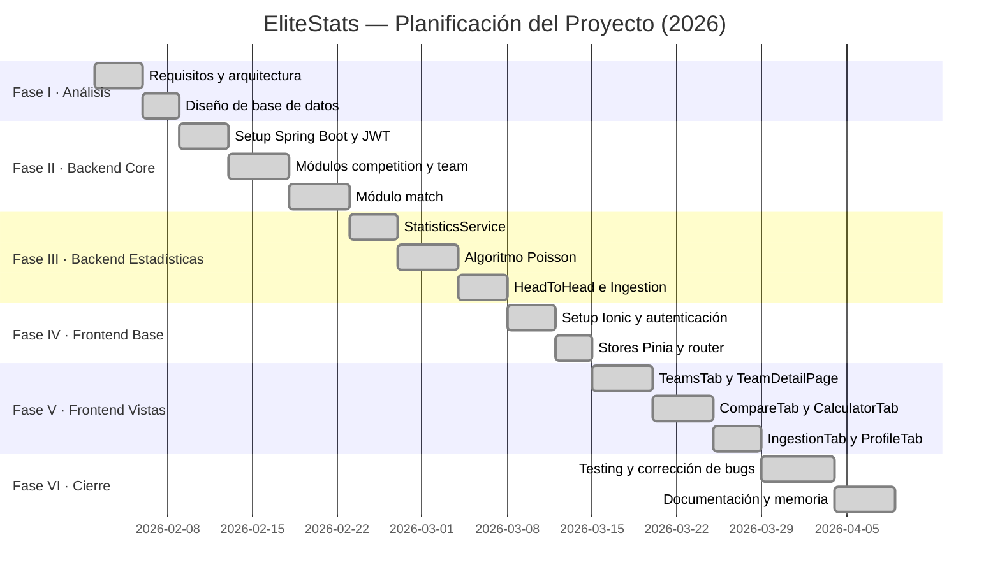

# EliteStats — Informe de Proyecto TFG

**Ciclo Formativo:** Desarrollo de Aplicaciones Multiplataforma (DAM2)  
**Curso:** 2025–2026  
**Alumno:** Martín Sánchez Novo  
**Tutor:** Marian Gómez Mosquera

---

## Abstract

### *EliteStats: A Full-Stack Progressive Web Application for Football Statistics and Probabilistic Match Prediction*

EliteStats is a full-stack football analytics platform combining a Progressive Web Application (PWA) built with Vue 3, Ionic 8, and Capacitor with a REST API backend developed in Java 21 using Spring Boot 4 following a hexagonal (Ports & Adapters) architecture. The system delivers team statistics, head-to-head comparisons, and match outcome probabilities derived from an independent Poisson model with exponential temporal decay, which weights recent fixtures more heavily than older ones. The backend exposes seventeen REST endpoints secured via stateless JSON Web Token (JWT) authentication managed by Spring Security, handles multiple simultaneous requests through its embedded Tomcat thread pool, and integrates with the external API-Football service to ingest real-world competition and fixture data. On the client side, the application consumes the backend API through Axios with request and response interceptors, leverages Pinia for reactive global state management, and persists session tokens in localStorage to maintain authentication across sessions. Parallel asynchronous calls are executed using `Promise.all` to minimize loading times. The interface, composed entirely from Ionic's component library, renders match outcome predictions through Chart.js visualizations and adapts seamlessly to both desktop and mobile viewports as a PWA installable on Android and iOS via Capacitor. The project demonstrates advanced competence in full-stack development, statistical modelling, RESTful service design, mobile-first UI engineering, and secure API integration.

**Keywords:** Football analytics, REST API, Progressive Web App, Poisson model, JWT authentication.

---

## 1. Objetivo

### Objetivo General

Desarrollar una plataforma web progresiva (PWA) denominada **EliteStats** que permita a los aficionados al fútbol consultar estadísticas avanzadas de equipos, comparar el historial de enfrentamientos entre ellos y obtener probabilidades de resultado calculadas mediante un modelo matemático, todo ello con autenticación de usuario, gestión de favoritos y capacidad de importar datos de ligas reales desde una API externa.

### Objetivos Específicos

| # | Objetivo | Criterio de éxito |
|---|---|---|
| OE1 | Implementar una API REST propia con Spring Boot que exponga al menos 15 endpoints funcionales con operaciones CRUD, autenticación JWT y gestión de errores estructurada | La API responde correctamente a todas las operaciones desde Postman y desde el cliente |
| OE2 | Integrar la API externa API-Football para importar competiciones, equipos y partidos reales | El módulo de ingesta carga datos completos de al menos una liga con un único endpoint |
| OE3 | Diseñar e implementar un algoritmo Poisson con decaimiento temporal que calcule probabilidades de resultado (1X2, Over/Under, BTTS) | El modelo devuelve porcentajes coherentes con estadísticas históricas conocidas |
| OE4 | Desarrollar una interfaz móvil-first con Ionic + Capacitor instalable como PWA en Android e iOS | La app se instala correctamente como PWA y es funcional en pantalla de móvil |
| OE5 | Implementar autenticación segura con JWT y gestión de sesión persistente en localStorage | El token persiste entre sesiones y el logout lo limpia correctamente |
| OE6 | Garantizar la fiabilidad mediante tests unitarios (Vitest) y tests E2E (Cypress) | El conjunto de tests ejecuta sin errores en el pipeline de CI |

### Integración de Módulos del Ciclo

| Módulo | Cobertura en EliteStats |
|---|---|
| **Programación de Servicios y Procesos** | API REST propia (opción 2) + consumo de API externa API-Football (opción 1). Concurrencia con Tomcat thread pool y `Promise.all` en frontend |
| **Programación Multimedia / Dispositivos Móviles** | PWA con Ionic + Capacitor. Persistencia en `localStorage`. Consumo de API con Axios |
| **Desenvolvemento de Interfaces** | Componentes Ionic, paleta de colores coherente, gráficos Chart.js, testing con Cypress y Vitest |
| **EIE** | Análisis DAFO, plan de negocio, segmento de mercado, plan de marketing y presupuesto |
| **Inglés Profesional** | Abstract técnico en inglés (apartado anterior) |

---

## 2. Descripción

### Motivación

La afición al fútbol va acompañada hoy de un interés creciente por los datos. Los sitios de estadísticas existentes (Sofascore, WhoScored, FBref) ofrecen información muy completa, pero ninguno incorpora de forma accesible un **modelo predictivo de resultado** que el usuario pueda ejecutar bajo demanda comparando los equipos de su elección. La motivación de EliteStats es crear esa herramienta: sencilla, gratuita, instalable como app en el móvil y con un motor de predicción estadísticamente fundamentado.

### Descripción General del Sistema

EliteStats se estructura en dos componentes desacoplados:

1. **Backend (Spring Boot 4 / Java 21):** API REST con arquitectura hexagonal que gestiona todos los datos, la lógica de negocio y la seguridad. Conecta con MySQL en producción y con H2 en memoria para el entorno de desarrollo y demos.

2. **Frontend (Vue 3 + Ionic 8 + Capacitor):** Aplicación PWA con cinco pestañas principales: equipos, comparativa H2H, calculadora de probabilidades, importación de datos y perfil de usuario.

### Arquitectura del Sistema

```
┌──────────────────────────────────────────┐
│         Frontend — PWA (Ionic + Vue 3)   │
│  TeamsTab │ CompareTab │ CalculatorTab   │
│  IngestionTab │ ProfileTab               │
└──────────────────┬───────────────────────┘
                   │ HTTPS / JSON (Axios)
┌──────────────────▼───────────────────────┐
│         Backend — Spring Boot 4          │
│  Auth │ Competition │ Team │ Match       │
│  Statistics │ User │ Ingestion           │
└────────────┬──────────────┬──────────────┘
             │              │
         MySQL           API-Football
       (Producción)      (API externa)
```

### Arquitectura Hexagonal del Backend

Cada módulo del backend sigue estrictamente la arquitectura Ports & Adapters, garantizando que la lógica de negocio sea independiente de cualquier framework:

```
{módulo}/v1/
├── application/
│   ├── domain/
│   │   ├── model/      ← POJOs puros, sin anotaciones de framework
│   │   └── port/       ← Interfaces (contratos)
│   └── service/        ← Lógica de negocio (depende SOLO de puertos)
└── infrastructure/
    └── adapter/
        ├── persistence/ ← Entidades JPA + repositorios (implementan puertos)
        └── rest/        ← Controllers + DTOs
```

### Fragmento de Código Destacado 1 — Algoritmo Poisson con Decaimiento Temporal

El punto técnico más avanzado del proyecto es el `RiskCalculationService`. En lugar de calcular probabilidades con porcentajes simples de victorias pasadas, implementa un **modelo Poisson independiente** que:

1. Calcula tasas de goles marcados/encajados ponderadas por recencia exponencial
2. Estima goles esperados cruzando las tasas de ataque y defensa de ambos equipos
3. Construye una matriz de puntuaciones 11×11 con probabilidades Poisson independientes
4. Deriva todos los mercados de apuestas (1X2, Over/Under 2.5, BTTS, descanso) de esa matriz

```java
/** Exponential decay rate per day (half-life ≈ 231 days). */
private static final double DECAY_KAPPA = 0.003;
/** Home teams score ~15% more goals on average across major leagues. */
private static final double HOME_ADVANTAGE = 1.15;

public RiskAnalysis calculate(final Long homeTeamId, final Long awayTeamId) {
    final List<Match> homeMatches = matchPort.findAllByTeamId(homeTeamId);
    final List<Match> awayMatches = matchPort.findAllByTeamId(awayTeamId);

    // Tasas ponderadas: [golesAnotados, golesConcedidos]
    final double[] homeRates = computeWeightedGoalRates(homeTeamId, homeMatches);
    final double[] awayRates = computeWeightedGoalRates(awayTeamId, awayMatches);

    // Goles esperados cruzando ataque local con defensa visitante y viceversa
    final double muHome = ((homeRates[0] + awayRates[1]) / 2.0) * HOME_ADVANTAGE;
    final double muAway = (awayRates[0] + homeRates[1]) / 2.0 / HOME_ADVANTAGE;

    final double[][] matrix = buildScoreMatrix(muHome, muAway);
    risk.setProbability1X2(derive1X2(matrix));  // suma regiones de la matriz
    calcGoalMarkets(risk, matrix, muHome, muAway);
    return risk;
}

private double[] computeWeightedGoalRates(final Long teamId, final List<Match> matches) {
    final Instant now = Instant.now();
    double wScored = 0, wConceded = 0, wTotal = 0;
    for (final Match m : matches) {
        final long daysAgo = ChronoUnit.DAYS.between(m.getMatchDate(), now);
        final double w = Math.exp(-DECAY_KAPPA * daysAgo);  // e^(-0.003 × días)
        wTotal += w;
        final boolean isHome = teamId.equals(m.getHomeTeamId());
        wScored   += w * (isHome ? m.getHomeGoals() : m.getAwayGoals());
        wConceded += w * (isHome ? m.getAwayGoals() : m.getHomeGoals());
    }
    return new double[]{ wScored / wTotal, wConceded / wTotal };
}
```

El decaimiento exponencial `e^(-0.003 × días)` hace que un partido de ayer tenga peso ≈1.0 mientras que uno de hace dos años tiene peso ≈0.11. Esto refleja que la forma reciente de un equipo es más relevante que sus resultados históricos lejanos.

### Fragmento de Código Destacado 2 — Seguridad JWT con Spring Security

El filtro `JwtAuthFilter` intercepta cada petición HTTP, valida el token y establece el contexto de seguridad de Spring sin estado de sesión en servidor:

```java
@Override
protected void doFilterInternal(HttpServletRequest request,
        HttpServletResponse response, FilterChain filterChain)
        throws ServletException, IOException {

    final String token = extractToken(request);

    if (StringUtils.hasText(token) && jwtService.isTokenValid(token)) {
        final String email = jwtService.extractEmail(token);
        if (email != null && SecurityContextHolder.getContext().getAuthentication() == null) {
            final var userDetails = userDetailsService.loadUserByUsername(email);
            final var auth = new UsernamePasswordAuthenticationToken(
                    userDetails, null, userDetails.getAuthorities());
            auth.setDetails(new WebAuthenticationDetailsSource().buildDetails(request));
            SecurityContextHolder.getContext().setAuthentication(auth);
        }
    }
    filterChain.doFilter(request, response);
}
```

### Fragmento de Código Destacado 3 — Paralelismo Asíncrono en el Frontend

`TeamDetailPage.vue` lanza tres peticiones API en paralelo con `Promise.all`, minimizando el tiempo de carga total frente a peticiones secuenciales:

```typescript
onMounted(async () => {
  // Paralelo: carga de datos del equipo + temporadas disponibles
  const [, seasonsRes] = await Promise.all([
    loadAll(),
    teamsApi.getSeasons(teamId),
  ]);
  teamSeasons.value = (seasonsRes.data as string[]) ?? [];
});

async function loadAll() {
  const [teamRes, matchRes, statsRes] = await Promise.all([
    teamsApi.getById(teamId),
    matchesApi.getLastByTeam(teamId, lastN.value),
    statisticsApi.getTeamStats(teamId, lastN.value, season),
  ]);
  team.value = teamRes.data;
  matches.value = matchRes.data;
  stats.value = statsRes.data;
}
```

Sin paralelismo, estas cuatro peticiones se ejecutarían secuencialmente sumando sus tiempos individuales. Con `Promise.all`, se lanzan simultáneamente y el tiempo total es el de la petición más lenta.

### Partes de Mayor Dificultad

| Dificultad | Descripción | Solución |
|---|---|---|
| **Modelo Poisson** | Pasar de porcentajes simples a una distribución estadística real con decaimiento temporal | Investigación sobre modelos de predicción de fútbol (Dixon-Coles, Poisson bivariante). Implementación iterativa con validación contra resultados conocidos |
| **Arquitectura hexagonal** | Mantener la independencia estricta entre capas sin contaminar el dominio con anotaciones JPA o Spring | Revisión continua de las reglas de dependencia. MapStruct para el mapeo sin contaminar el dominio |
| **DevTools + MapStruct** | El hot-reload de Spring DevTools recargaba clases MapStruct corruptas causando `ClassFormatError: Duplicate method` | Documentar el procedimiento correcto: detener el servidor, borrar `target/`, recompilar |
| **CORS + Proxy Vite** | Las peticiones del frontend fallaban con CORS al usar `ionic serve` en vez del dev server de Vite | Configurar el proxy en `vite.config.ts` y documentar que solo funciona con `npm run dev` |

---

## 3. Alcance

### Lo que incluye EliteStats

| Funcionalidad | Descripción |
|---|---|
| **Consulta de equipos** | Lista de equipos filtrable por liga y temporada, con logos y nombre de competición |
| **Estadísticas de equipo** | Victorias/empates/derrotas, goles, promedios, desglose local/visitante, últimos N partidos |
| **Comparativa H2H** | Historial de enfrentamientos directos: marcador más repetido, BTTS, Over/Under, clean sheets, resultados al descanso |
| **Calculadora de probabilidades** | Modelo Poisson que genera probabilidades 1X2, Over/Under 2.5, BTTS y resultado al descanso |
| **Importación de datos** | Ingesta de equipos y partidos desde API-Football para cualquier liga y temporada |
| **Autenticación** | Registro, login con JWT, persistencia de sesión en localStorage |
| **Favoritos** | Guardar y gestionar equipos favoritos por usuario autenticado |
| **PWA / Móvil** | Instalable en Android e iOS a través de Capacitor; responsive en cualquier pantalla |

### Lo que queda fuera del alcance

| Exclusión | Impacto |
|---|---|
| **Datos en tiempo real** | No hay partidos en vivo ni actualización automática de marcadores. El usuario debe importar datos manualmente. El impacto es mínimo para el objetivo del proyecto, que se centra en análisis histórico |
| **Más deportes** | Solo fútbol en esta versión. La arquitectura está diseñada para permitir extensión futura sin reescribir el código base |
| **Predicción con IA/ML** | El modelo Poisson es estadísticamente robusto pero no usa machine learning. Una versión avanzada podría incorporar modelos entrenados con más variables |
| **Notificaciones push** | No se implementan alertas de partidos. Reducción del alcance deliberada para priorizar la calidad del análisis estadístico |
| **Integración directa con casas de apuestas** | La app es exclusivamente informativa; no realiza apuestas ni conecta con plataformas de juego |

La limitación más relevante —la ausencia de datos en tiempo real— no condiciona el éxito del proyecto, ya que el objetivo central es el análisis estadístico e histórico, no el marcador en directo.

---

## 4. Planificación

### Análisis de Viabilidad

**Técnica:** El stack tecnológico (Spring Boot, Vue 3, Ionic) es ampliamente documentado y se corresponde con las competencias adquiridas durante el ciclo formativo. La arquitectura hexagonal y el modelo Poisson suponen un reto técnico asumible con investigación adicional.

**Económica:** El proyecto utiliza exclusivamente tecnologías open source. El único coste potencial es la API key de API-Football (plan gratuito: 100 peticiones/día; suficiente para desarrollo y demos). El despliegue de producción utiliza MySQL remoto gratuito (freesqldatabase.com).

**Legal/Seguridad:** La aplicación no almacena datos financieros ni información sensible más allá de credenciales de usuario. Las contraseñas se almacenan con BCrypt. Los tokens JWT caducan en 24 horas. La app no realiza apuestas ni accede a fondos reales.

### Análisis DAFO

|  | **Factores Positivos** | **Factores Negativos** |
|---|---|---|
| **Factores Internos** | **FORTALEZAS** ① Modelo Poisson avanzado: ventaja técnica diferencial frente a apps similares ② Arquitectura hexagonal: código mantenible, testeable y extensible ③ PWA: funciona en cualquier dispositivo sin instalación en tienda ④ Gratuito y sin anuncios en versión inicial ⑤ JWT stateless: seguro y escalable | **DEBILIDADES** ① Solo cubre fútbol; otros deportes no están disponibles ② Datos limitados a lo importado manualmente; sin actualización automática ③ Sin datos en tiempo real (no hay WebSockets) ④ Dependencia de API-Football para la ingesta de datos nuevos |
| **Factores Externos** | **OPORTUNIDADES** ① Mercado global de apuestas deportivas en crecimiento (>150.000M€ anuales) ② Alta demanda de herramientas de análisis deportivo accesibles y gratuitas ③ Alta penetración de smartphones: PWA permite alcanzar usuarios móviles sin pasar por tiendas ④ Modelo freemium viable: estadísticas básicas gratis, predicciones avanzadas de pago | **AMENAZAS** ① Competencia de plataformas establecidas (Sofascore, WhoScored, FBref) con grandes equipos y recursos ② Límites de peticiones y posible incremento de precio de la API-Football ③ Regulación variable de las apuestas deportivas por países puede limitar la audiencia ④ Riesgo de uso irresponsable de las predicciones (las probabilidades son orientativas, no certeras) |

### Plan de Producción — Fases y Cronograma

| Fase | Tareas principales | Duración | Horas | Recursos / Herramientas |
|---|---|---|---|---|
| **I. Análisis y diseño** | Análisis de requisitos, diseño de arquitectura, diseño de base de datos, selección de stack | 1 semana | 8h | Documentación Spring/Vue/Ionic, draw.io |
| **II. Backend Core** | Setup Spring Boot, seguridad JWT, módulos `competition`, `team`, `match` | 2 semanas | 15h | IntelliJ IDEA, Postman, H2 console |
| **III. Backend Estadísticas** | `StatisticsService`, algoritmo Poisson, `HeadToHeadService`, módulo `ingestion` | 1.5 semanas | 14h | IntelliJ IDEA, calculadora Poisson, API-Football dashboard |
| **IV. Frontend Base** | Setup Ionic + Vite, Vue Router, stores Pinia, flujo de autenticación | 1 semana | 10h | VS Code, npm, Chrome DevTools |
| **V. Frontend Vistas** | Las 8 vistas (`TeamsTab`, `TeamDetailPage`, `CompareTab`, `CalculatorTab`, `IngestionTab`, `ProfileTab`, `LoginPage`, `RegisterPage`) | 2 semanas | 18h | VS Code, Ionic DevTools, vue-chartjs |
| **VI. Testing y cierre** | Tests unitarios (Vitest), tests E2E (Cypress), corrección de bugs, documentación | 1.5 semanas | 13h | Vitest, Cypress, Markdown |

**Total estimado: ~78 horas**

### Diagrama de Gantt



### Justificación del Orden de Implementación

Se optó por desarrollar el backend completo antes de comenzar el frontend por las mismas razones que en proyectos análogos del sector: contar con una API estable y probada elimina el riesgo de refactorizaciones costosas en el cliente durante su desarrollo. Postman permitió validar todos los endpoints independientemente del frontend.

Dentro del backend, el módulo de estadísticas se desarrolló después de los módulos de datos (competition, team, match) para poder trabajar con datos reales del perfil `json` y verificar la coherencia del algoritmo Poisson contra resultados históricos conocidos.

### Plan de Marketing

**Segmento objetivo:** Aficionados al fútbol con interés en análisis estadístico y apuestas deportivas, principalmente hombres de 18–40 años con dispositivo móvil.

**Propuesta de valor:** Modelo matemático avanzado (Poisson), gratuito, sin publicidad, instalable como app en el móvil, sin necesidad de crear cuenta para las consultas básicas.

**Canales de distribución:**
- **Google Play / App Store:** Distribución nativa vía Capacitor con palabras clave como *predicciones fútbol*, *estadísticas equipos*, *calculadora apuestas*.
- **Reddit:** Comunidades como r/soccer, r/sportsbetting, r/LaLiga — publicación de análisis generados con la app para atraer usuarios orgánicamente.
- **Twitter/X:** Publicación de predicciones automáticas de partidos destacados de la jornada, con enlace a la app.
- **Telegram:** Grupos de aficionados donde se puede compartir la herramienta directamente.
- **SEO web:** La versión PWA en navegador es indexable; las páginas de estadísticas de equipos y ligas se posicionan para búsquedas de nicho.

**Prevención de riesgos:**

| Riesgo | Tipo | Medida preventiva |
|---|---|---|
| Pérdida del código fuente | Técnico/lógico | Control de versiones con Git y repositorio en Azure DevOps |
| Caída de la API-Football | Técnico | Datos previamente importados persisten en base de datos local; la app funciona con los datos en caché |
| Lesiones por trabajo prolongado | Laboral | Ergonomía, pausas cada 50 minutos, monitor a la altura de los ojos |
| Uso irresponsable de predicciones | Legal/ético | Disclaimers claros en la UI: «Las probabilidades son orientativas y no constituyen asesoramiento de apuestas» |

---

## 5. Medios a Utilizar

### Hardware

| Recurso | Descripción |
|---|---|
| Ordenador portátil | Desarrollo, compilación y pruebas |
| Smartphone Android | Pruebas de la PWA en dispositivo real |
| Conexión a internet | Consulta de documentación, descarga de dependencias, acceso a API-Football y MySQL remoto |

### Software — Backend

| Herramienta | Versión | Licencia | Uso |
|---|---|---|---|
| Java | 21 (LTS) | GPL v2 + CE | Lenguaje del servidor |
| Spring Boot | 4.0.6 | Apache 2.0 | Framework REST |
| Spring Security | 7.x | Apache 2.0 | Autenticación JWT |
| Spring Data JPA + Hibernate | 3.x | Apache 2.0 | ORM / persistencia |
| MapStruct | 1.6.3 | Apache 2.0 | Mapeo de objetos sin reflexión |
| Lombok | 1.18.x | MIT | Reducción de boilerplate |
| jjwt | 0.12.6 | Apache 2.0 | Generación y validación de JWT |
| SpringDoc OpenAPI | 2.8.6 | Apache 2.0 | Swagger UI |
| MySQL | 5.5+ | GPL | Base de datos de producción |
| H2 Database | 2.x | EPL | Base de datos de desarrollo/demos |
| Maven | 3.x | Apache 2.0 | Gestión de dependencias y build |
| IntelliJ IDEA | Community | Apache 2.0 | IDE backend |

### Software — Frontend

| Herramienta | Versión | Licencia | Uso |
|---|---|---|---|
| Vue 3 | 3.x | MIT | Framework reactivo |
| Ionic | 8.x | MIT | Componentes UI mobile-first |
| Capacitor | 8.x | MIT | Empaquetado nativo Android/iOS |
| TypeScript | 5.x | Apache 2.0 | Tipado estático |
| Vite | 5.x | MIT | Build tool y dev server |
| Pinia | 2.x | MIT | Gestión de estado global |
| Axios | 1.x | MIT | Cliente HTTP |
| vue-chartjs / Chart.js | 5.x / 4.x | MIT | Gráficos estadísticos |
| vue-router | 4.x | MIT | Enrutamiento SPA |
| Visual Studio Code | — | MIT | IDE frontend |

### Otras Herramientas

| Herramienta | Uso |
|---|---|
| Git + Azure DevOps | Control de versiones y gestión del proyecto |
| Postman | Prueba y documentación de endpoints de la API |
| Cypress | Tests E2E del frontend |
| Vitest | Tests unitarios del frontend |
| API-Football | Fuente de datos de competiciones, equipos y partidos reales |
| freesqldatabase.com | MySQL remoto gratuito para producción |

### Recursos Humanos

El proyecto es desarrollado íntegramente por un único alumno (análisis, diseño, backend, frontend, testing y documentación). Tiempo estimado: **78 horas**.

---

## 6. Presupuesto

### Desglose de Costes

| Concepto | Detalle | Total estimado |
|---|---|---|
| **Mano de obra** | 78 h × 50,00 €/h (análisis, diseño, desarrollo backend, desarrollo frontend, testing y documentación) | 3.900,00 € |
| **Licencias de software** | Todas las herramientas son open source o de licencia gratuita | 0,00 € |
| **Infraestructura** | MySQL remoto gratuito (freesqldatabase.com), hardware propio | 0,00 € |
| **API-Football** | Plan gratuito (100 req/día) suficiente para desarrollo y demos | 0,00 € |
| **Subtotal** | | **3.900,00 €** |
| **IVA (21 %)** | | 819,00 € |
| **TOTAL** | | **4.719,00 €** |

### Financiación

El proyecto está íntegramente financiado por el alumno:

- **Software:** 0,00 € — tecnologías 100% open source (Spring Boot, Vue, Ionic, MySQL Community).
- **Capital humano:** La inversión principal es el tiempo del desarrollador, valorado en 3.900 € en la tabla anterior.
- **Infraestructura:** Uso de hardware propio y servicios en la nube gratuitos para la fase MVP.

Si en una fase posterior se escalara el producto, los costes principales serían la suscripción a API-Football (desde 10 €/mes para mayor volumen de peticiones) y un servidor VPS (desde 5 €/mes).

---

## 7. Ejecución

### Inicio y Autenticación

**Acción:** El usuario accede a la app en el navegador o la abre instalada como PWA.

**Flujo sin cuenta:** Puede navegar directamente a `TeamsTab`, `CompareTab` y `CalculatorTab` sin necesidad de registrarse.

**Flujo con cuenta:**
1. Accede a `ProfileTab` y pulsa "Iniciar sesión".
2. Introduce email y contraseña → `POST /api/auth/login`.
3. El backend valida las credenciales con BCrypt, genera un JWT firmado con HMAC-SHA y devuelve `{ token, userId, username, email }`.
4. `authStore.setSession()` persiste el token en `localStorage` como `sportstats_token`.
5. El interceptor de Axios añade automáticamente `Authorization: Bearer <token>` a todas las peticiones siguientes.
6. Si el token expira (24h) y el servidor responde 401, el interceptor llama `authStore.logout()` automáticamente.

### Navegación Principal — TeamsTab

**Acción:** El usuario selecciona una liga y temporada.

**Proceso:**
1. `onMounted` llama `fetchCompetitions()` → `GET /api/competitions`.
2. Al seleccionar liga/temporada: `GET /api/teams?competitionId=X&season=Y`.
3. Si está autenticado: `GET /api/users/me/favorites` para marcar favoritos.
4. Los equipos se muestran con logo (URL de API-Football), nombre y estrella de favorito.
5. Pulsar un equipo navega a `TeamDetailPage`.

### Detalle de Equipo — TeamDetailPage

**Acción:** El usuario consulta las estadísticas de FC Barcelona, últimos 10 partidos, temporada 2024.

**Proceso:**
1. `Promise.all` lanza en paralelo: `getById(id)`, `getLastByTeam(id, 10)`, `getTeamStats(id, 10, "2024")` y `getSeasons(id)`.
2. Se muestra la tarjeta del equipo, gráficos de barras (rendimiento W/D/L y local/visitante) y la lista de últimos partidos con resultado codificado por color.
3. Cambiando el selector de N partidos (5 / 10 / Todos) se recargan stats y partidos automáticamente.

### Comparativa H2H — CompareTab

**Acción:** El usuario compara Real Madrid vs FC Barcelona.

**Proceso:**
1. Selecciona liga → se filtran temporadas disponibles → selecciona temporada.
2. Selecciona equipo local y visitante.
3. `GET /api/h2h?team1Id=541&team2Id=529` → el backend filtra partidos donde cualquiera de los dos equipos jugó como local o visitante.
4. Se muestran: contador de resultados, promedios de goles, porcentaje BTTS, marcador más repetido, resultados al descanso y gráfico de distribución de resultados.

### Calculadora de Probabilidades — CalculatorTab

**Acción:** El usuario calcula las probabilidades para Atlético Madrid (local) vs Sevilla (visitante).

**Proceso:**
1. Selecciona liga → carga equipos de todas las temporadas disponibles (sin filtro de temporada para maximizar datos históricos).
2. Selecciona equipo local y visitante → `GET /api/risk?homeTeamId=530&awayTeamId=536`.
3. El backend:
   a. Recupera TODOS los partidos históricos de ambos equipos.
   b. Calcula tasas ponderadas de goles con decaimiento exponencial `e^(-0.003 × días)`.
   c. Estima goles esperados cruzando tasas de ataque y defensa con factor de ventaja local (×1.15).
   d. Construye la matriz de probabilidades Poisson 11×11.
   e. Deriva probabilidades 1X2, Over/Under 2.5, BTTS y resultado al descanso.
4. La app muestra los resultados en tarjetas y un gráfico de tarta (Doughnut) con las probabilidades 1X2.

**Ejemplo de resultado:** Atlético Madrid vs Sevilla:
- Local (Atlético): ~45% | Empate: ~28% | Visitante (Sevilla): ~27%
- Over 2.5: ~52% | Under 2.5: ~48%
- BTTS Sí: ~48% | No: ~52%

### Importación de Datos — IngestionTab

**Acción:** El usuario importa La Liga 2024/25 desde API-Football.

**Proceso (requiere autenticación):**
1. Introduce: ID de liga = `140`, temporada = `2024`, nombre = `La Liga`.
2. `POST /api/ingestion/leagues/140?season=2024&competitionName=La+Liga` con `Authorization: Bearer <token>`.
3. El backend llama a API-Football para obtener equipos y luego partidos.
4. Crea la competición automáticamente si no existe; evita duplicados por `apiId`.
5. En ~30-60s, la app muestra el mensaje de éxito con el número de equipos y partidos importados.

### Gestión de Favoritos — ProfileTab

**Acción:** El usuario gestiona sus equipos favoritos.

**Proceso:**
1. Muestra la lista de favoritos: `GET /api/users/me/favorites`.
2. Pulsar el icono de papelera: `DELETE /api/users/me/favorites/{teamId}` → respuesta 204.
3. La lista se actualiza reactivamente en el store Pinia.
4. El botón de favorito en `TeamsTab` y `TeamDetailPage` refleja el cambio automáticamente.

### Control de Calidad y Testing

| Tipo de test | Framework | Cobertura |
|---|---|---|
| **Tests unitarios** | Vitest | Composables, stores Pinia, lógica de transformación de datos |
| **Tests E2E** | Cypress | Flujos completos: login, consulta de equipos, navegación entre tabs, calculadora |
| **Pruebas manuales de API** | Postman | Todos los endpoints: autenticación, CRUD, errores HTTP (401, 404, 409, 502) |

---

## 8. Diseño de la Base de Datos

### Diagrama Entidad-Relación

```
competition (1) ─────── (N) team
    │
    └── (1) ─────────────── (N) match_fixture (vía home_team_id y away_team_id)

app_user (1) ──────────── (N) user_favorite
```

### Descripción de Tablas

#### `competition`

| Campo | Tipo | Restricciones | Descripción |
|---|---|---|---|
| `id` | BIGINT | PK, AUTO_INCREMENT | Identificador interno |
| `name` | VARCHAR(100) | NOT NULL | Nombre de la competición |
| `api_id` | INT | UNIQUE | ID en API-Football |
| `type` | VARCHAR(50) | | Tipo (League, Cup...) |
| `season` | VARCHAR(10) | | Temporada (ej. "2024") |
| `logo_url` | VARCHAR(500) | | URL del logo |

#### `team`

| Campo | Tipo | Restricciones | Descripción |
|---|---|---|---|
| `id` | BIGINT | PK, AUTO_INCREMENT | Identificador interno |
| `name` | VARCHAR(100) | NOT NULL | Nombre completo |
| `short_name` | VARCHAR(10) | | Nombre corto |
| `logo_url` | VARCHAR(500) | | URL del logo |
| `api_id` | INT | UNIQUE | ID en API-Football |
| `competition_id` | BIGINT | FK → `competition.id` | Competición a la que pertenece |

#### `match_fixture`

| Campo | Tipo | Restricciones | Descripción |
|---|---|---|---|
| `id` | BIGINT | PK, AUTO_INCREMENT | Identificador interno |
| `home_team_id` | BIGINT | NOT NULL | ID del equipo local |
| `away_team_id` | BIGINT | NOT NULL | ID del equipo visitante |
| `home_team_name` | VARCHAR(100) | | Nombre del equipo local (desnormalizado) |
| `away_team_name` | VARCHAR(100) | | Nombre del equipo visitante (desnormalizado) |
| `home_team_logo` | VARCHAR(500) | | Logo del equipo local (desnormalizado) |
| `away_team_logo` | VARCHAR(500) | | Logo del equipo visitante (desnormalizado) |
| `match_date` | DATETIME | | Fecha y hora del partido |
| `status` | VARCHAR(20) | | Estado (FINISHED, SCHEDULED...) |
| `home_goals` | INT | | Goles local (FT) |
| `away_goals` | INT | | Goles visitante (FT) |
| `ht_home_goals` | INT | | Goles local (HT) |
| `ht_away_goals` | INT | | Goles visitante (HT) |
| `competition_id` | BIGINT | | ID de la competición |
| `competition_name` | VARCHAR(100) | | Nombre de la competición (desnormalizado) |
| `season` | VARCHAR(10) | | Temporada |
| `api_id` | BIGINT | UNIQUE | ID en API-Football |

#### `app_user`

| Campo | Tipo | Restricciones | Descripción |
|---|---|---|---|
| `id` | BIGINT | PK, AUTO_INCREMENT | Identificador interno |
| `username` | VARCHAR(50) | NOT NULL | Nombre de usuario |
| `email` | VARCHAR(150) | NOT NULL, UNIQUE | Correo electrónico |
| `password_hash` | VARCHAR(255) | NOT NULL | Hash BCrypt de la contraseña |
| `created_at` | DATETIME | | Fecha de registro |

#### `user_favorite`

| Campo | Tipo | Restricciones | Descripción |
|---|---|---|---|
| `id` | BIGINT | PK, AUTO_INCREMENT | Identificador interno |
| `user_id` | BIGINT | NOT NULL, FK → `app_user.id` | Usuario propietario |
| `team_id` | BIGINT | NOT NULL | Equipo favorito |
| `team_name` | VARCHAR(100) | | Nombre del equipo (desnormalizado) |
| `team_logo` | VARCHAR(500) | | Logo del equipo (desnormalizado) |
| — | — | UNIQUE(`user_id`, `team_id`) | Un usuario no puede duplicar un favorito |

### Relaciones de Cardinalidad

- **`competition` — `team` (1:N):** Una competición tiene múltiples equipos; cada equipo pertenece a una competición. FK: `team.competition_id → competition.id`.
- **`app_user` — `user_favorite` (1:N):** Un usuario puede tener múltiples favoritos; cada favorito pertenece a un usuario. FK: `user_favorite.user_id → app_user.id`.
- **`match_fixture` y equipos (N:M desnormalizado):** Cada partido tiene dos equipos (local y visitante). Esta relación **no usa claves foráneas** de forma deliberada: los registros de partidos son históricos e inmutables. Al almacenar `home_team_name`, `home_team_logo` directamente en la tabla, el historial de partidos permanece intacto aunque los datos del equipo cambien en el futuro. Esta es una práctica habitual en bases de datos de estadísticas deportivas.

### Nota sobre las Claves Foráneas

La implementación utiliza arquitectura hexagonal, que mantiene las entidades JPA desacopladas entre sí para evitar dependencias circulares entre módulos de dominio independientes (`team`, `competition`, `user`, `match`). Sin embargo, las relaciones `team → competition` y `user_favorite → app_user` son lo suficientemente claras y unidireccionales para justificar una FK real a nivel de base de datos, lo que añade integridad referencial sin comprometer la arquitectura.

